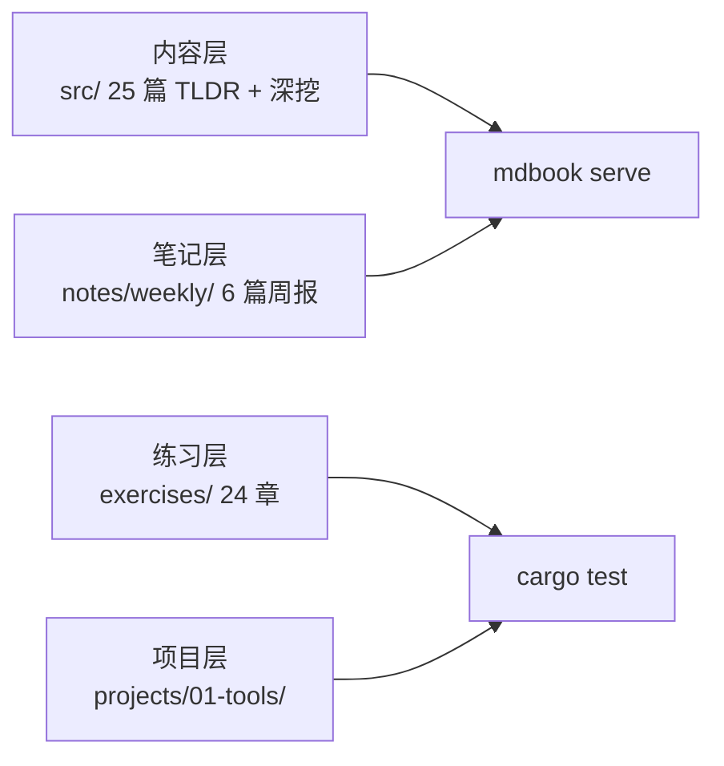

# Norman's Rust 笔记本

面向个人的 Rust 学习笔记本——以 mdbook 为主体、rustlings 风格练习为辅助、真实工作流项目为输出。不是公共教程，不是社区项目，是 Norman 自己学 Rust 的第二大脑。

## 项目简介



| 层级 | 说明 | 规模 |
|------|------|------|
| **内容** | `src/` — basic / ownership-lifetimes / concurrency / deep-dives / compiler-pitfalls | 25 篇 |
| **练习** | `exercises/` — rustlings 24 章 fork，`#[test] #[ignore]` 格式 | ~100 题 |
| **答案** | `solutions/` — 不含 Cargo.toml，编译隔离 | 23 文件 |
| **项目** | `projects/01-tools/` — sunniwell 工作流脚本 Rust 化 | 1 CLI crate |
| **笔记** | `notes/` — 周报 W27-W32 + code-readings + patterns | 6 篇周报 |

## 快速开始

```bash
# 安装依赖（仅首次）
cargo install mdbook just

# 启动浏览器预览
just serve

# 运行全部练习
just test

# 清理构建产物
just clean

# 生成周报模板
just weekly
```

## 内容导航

| 模块 | 亮点 |
|------|------|
| `basic/` | 6 篇 TLDR — Rust vs JS/TS 对比表风格 |
| `ownership-lifetimes/` | 所有权三件套 + 生命周期 + 智能指针 |
| `concurrency/` | 线程 / async-await / Tokio 入门 |
| `compiler-pitfalls/` | 5 个真实生命周期编译错误案例（错码→报错→解释→修复） |
| `deep-dives/` | too-many-lists 链表翻译 + Crust of Rust 笔记 |

## 仓库哲学

> 先改编译，再讲理论。练习先行，概念跟进。每篇 ≤ 4 页，读完就能写。
