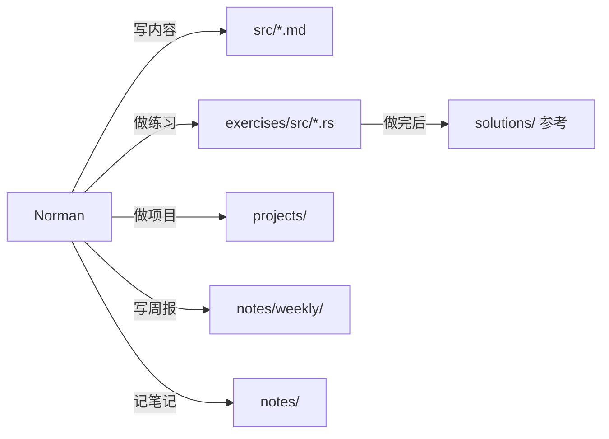
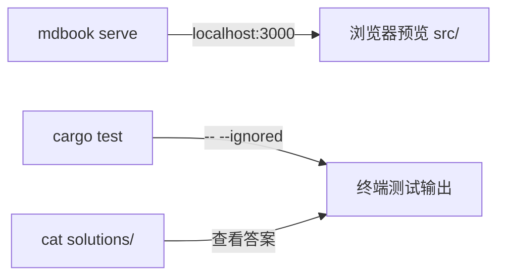
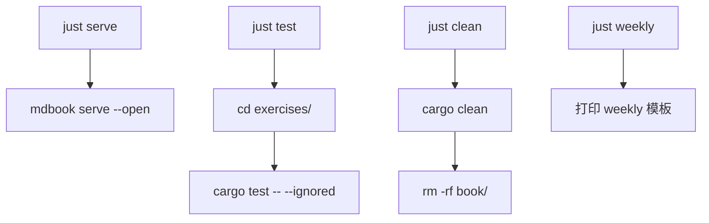

# Architecture · learn-rust 仓库设计

> 状态：草稿 · 日期：2026-07-02
>
> **设计依据**：调研与目录设计已归档至 [`docs/reference/sources.md`](../reference/sources.md)
> **上游 PRD**：[learn-rust-notebook](../prd/2026-07-02-learn-rust-notebook.md)（功能需求 → 架构实现）
> **下游文档**：[Phase](../phase/2026-07-02-v1-foundation.md)（按本架构执行）
> **评审输入**：已吸收至本文档（P0 solutions 隔离 · P1 内容去重 · P1 内容量修正）
---

## §1 架构概览

```mermaid
graph TD
    subgraph 内容层
        SRC[src/ mdbook 内容<br/>basic + ownership-lifetimes<br/>+ concurrency + deep-dives<br/>+ compiler-pitfalls + profiling]
    end

    subgraph 练习层
        EX[exercises/ 单 crate<br/>23 章题目 #[ignore]]
        SOL[solutions/ 只读答案<br/>不含 Cargo.toml]
    end

    subgraph 项目层
        P01[projects/01-tools<br/>P0 CLI 多子项目]
        P02[projects/02-component<br/>P1 Rust 组件]
        P03[projects/03-big<br/>P2 大项目]
    end

    subgraph 笔记层
        NOTES[notes/ 自由区<br/>weekly + code-readings<br/>+ patterns + gotchas]
    end

    subgraph 基建
        JUST[justfile<br/>serve / test / clean / weekly]
        MDBOOK[mdbook<br/>playground.editable=true]
        CARGO[cargo test<br/>-- --ignored]
    end

    SRC --> MDBOOK
    MDBOOK --> |mdbook serve| BROWSER[浏览器预览]
    EX --> CARGO
    SOL -.-> |cat 查看| EX
    JUST --> MDBOOK
    JUST --> CARGO
    NOTES -.-> |交叉引用| SRC
    P01 --> |实战产出| CARGO
    P02 --> |实战产出| CARGO
```

**核心设计**：四层分离——内容（写）、练习（练）、项目（用）、笔记（记）。基建只依赖 mdbook + cargo test，无外部服务。
> 溯源：← 设计模式对比矩阵（5 模式分类）+ [PRD §2](../prd/2026-07-02-learn-rust-notebook.md)（5 大功能模块）

---

## §2 技术选型

| 组件 | 选型 | 替代方案（已拒绝） | 拒绝理由 |
|---|---|---|---|
| 内容引擎 | mdbook | Docusaurus / VuePress / Hugo | Rust 圈标准，`playground.editable` 开箱可用 |
| 练习引擎 | 单 crate + `#[test] #[ignore]` | rustlings 自研 CLI / mdbook-exerciser | 最小复杂度，一行 `cargo test` 即可 |
| 任务运行 | just（justfile） | Makefile / cargo xtask | Rust 圈惯例，比 Makefile 简洁，比 xtask 轻量 |
| 深度专题 | too-many-lists 核心 6 章内嵌 | 外链跳转 | 避免外链不可控，阅读→练习路径压平 |
| 进度管理 | weekly markdown + DEVLOG | Notion / Trello / GitHub Projects | 零外部依赖，与代码同仓库 |
| CI | 不做 | GitHub Actions | 个人仓库，本地 `cargo test` 足够 |
| 多语言 | 不做 | mdbook-gettext / po/ | 仅面向自己，中文即可 |

---

## §3 目录结构设计

### §3.1 顶层

```
learn-rust/
├── README.md               # 极简 10 行
├── LICENSE                 # MIT
├── book.toml               # mdbook 配置
├── justfile                # 4 命令
├── rustfmt.toml
├── clippy.toml
├── docs/                   # SDD 文档体系（PRD + Architecture + Phase + Reference）
├── src/                    # mdbook 内容源
├── exercises/              # 练习 crate
├── solutions/              # 答案（只读，不含 Cargo.toml）
├── projects/               # 实战项目
└── notes/                  # 自由笔记
```

### §3.2 内容层（src/）详细

> 详细文件清单见本架构 §3.2-§3.5 各子节。关键设计决策：

- **basic/ 11 章**按 S/M/L 三档粒度分，统一用 §6.5 模板（一句话→对比→对比表→踩坑→链接）
- **ownership-lifetimes/ 6 章**按时间分配标注（ownership 30%、lifetime-basic 最优先、smart-pointer 15%）
- **compiler-pitfalls/ 按主题聚类**（lifetime / borrow / trait-bound / move / type-inference），每个 case 固定 4 段格式
- **deep-dives/ 含 3 个 P1 入口**（contributing-to-rust / crust-of-rust-notes / code-readings），给"学到深处"留可持续钩子

### §3.3 练习层（exercises/ + solutions/）

**exercises/ 单 crate 结构**：

```
exercises/
├── Cargo.toml
├── README.md               # 与 src/ 章节映射 + 快进指引
└── src/
    ├── lib.rs              # 模块声明
    ├── intro.rs            # 00：5 题，快进
    ├── variables.rs        # 01：8 题，快进
    ├── ...
    ├── hashmaps.rs         # 11：深做
    ├── ...
    └── conversions.rs      # 23：深做
```

每题格式：

```rust
#[test]
#[ignore]
fn variables1() {
    // TODO: 修复下面的代码让它编译通过
    // I AM NOT DONE
    let x = 5;
    println!("x has the value {}", x);
}
```

**solutions/ 编译隔离设计**：

```
solutions/
├── intro.rs                # 不含 Cargo.toml！
├── variables.rs
└── ...
```

每个 `.rs` 文件头部固定注释：

```rust
// solutions/<name>.rs — 本文件不会被 cargo 编译进 exercises
// 做题前先删掉 exercises/ 对应文件的 // I AM NOT DONE 标记再实现
// 需要查看时直接 `cat solutions/<name>.rs`
```

### §3.4 项目层（projects/）

每个项目目录结构：

```
projects/01-tools/
├── README.md               # 选型说明 + 目标脚本列表
├── DEVLOG.md               # 撞墙记录
└── tools/                  # 多子 crate（cargo workspace）
    ├── Cargo.toml
    └── ...
```

**`projects/02-component/` 决策框架**（预埋，不阻塞 v1.0）：

```text
Server 语言是 Node.js? → napi-rs native add-on
Server 语言是 Python?  → PyO3 import 库或独立 microservice
Server 语言是 Go?      → FFI 调用或独立 microservice (gRPC)
Server 已是 Rust?      → cargo workspace 子 crate
未明?                  → 独立 microservice (HTTP/JSON)
```

### §3.5 笔记层（notes/）

```
notes/
├── _index.md               # ★ 必填：一句描述 + 所有子文件链接
├── weekly/                 # YYYY-WNN.md
├── code-readings/          # ripgrep / tokio 源码笔记
├── patterns/               # Rust idiom
├── idiomatic-rust.md
├── gotchas.md              # 仅运行时语义陷阱
├── perf-notes/
├── api-design.md
└── release-notes/          # YYYY-MM-rust-X.YY.md
```

**`notes/gotchas.md` 与 `compiler-pitfalls/` 边界**：
- `compiler-pitfalls/` = **编译期**错误（编译器能捕获的）
- `notes/gotchas.md` = **运行时**语义陷阱（迭代器惰性、UTF-8 字节切片慢等不报错但行为意外的情况）

---

## §4 组件关系与数据流

### §4.1 写入流（Norman → 仓库）



### §4.2 读取流（仓库 → Norman）



### §4.3 构建流



---

## §5 关键设计决策（ADR 索引）

| # | 决策 | 日期 | 理由 |
|---|---|---|---|
| 1 | 用 mdbook 而非 Docusaurus/VuePress | 2026-07-02 | Rust 圈标准，`playground.editable` 零配置，默认主题够用 |
| 2 | 练习用单 crate + `#[ignore]` 而非 rustlings 自研 CLI | 2026-07-02 | 最小复杂度，一行命令跑全部，不维护额外二进制 |
| 3 | `solutions/` 不含 `Cargo.toml` | 2026-07-02 | P0 编译隔离，防止答案意外参与编译 |
| 4 | 基础章用 TLDR 对比表而非系统讲解 | 2026-07-02 | Norman 有编程基础，不需要从零学语法 |
| 5 | CI / webdriver / 自研插件全不做 | 2026-07-02 | 个人仓库，投入产出比极低 |
| 6 | 内容去重按阶段分层（编译期/概念/实现/运行时） | 2026-07-02 | P1 修正，防同一知识点在 3 个地方出现 |
| 7 | v1.0 只交付 15-20 篇核心内容 | 2026-07-02 | 6 周写不完 46-51 篇，v1.0 必须留 TODO 占位 |
| 8 | justfile 而非 Makefile/xtask | 2026-07-02 | Rust 圈惯例，比 Makefile 简洁，比 xtask 轻量 |
> **ADR 溯源表**（每条决策 → 调研依据 → 评审修正）：

---

## §6 内容去重策略

| 内容类型 | 放哪里 | 不放哪里 |
|---|---|---|
| 编译期错误案例 | `src/compiler-pitfalls/` | `notes/gotchas.md` |
| 概念/模式讲解 | `src/ownership-lifetimes/` / `concurrency/` | `compiler-pitfalls/` |
| 具体实现（链表等） | `src/deep-dives/linked-lists/` | `ownership-lifetimes/smart-pointer.md`（仅概念，不实现） |
| 运行时语义陷阱 | `notes/gotchas.md` | `compiler-pitfalls/` |
| 惯用法/设计模式 | `notes/patterns/` | `src/basic/`（基础章不教 idiom） |

**原则**：同一知识点的不同角度可以出现在不同位置（如 lifetime 概念在 ownership-lifetimes/，错误案例在 compiler-pitfalls/），但**同一角度的内容不能出现在两处**。

---

## §7 commit message 约定

| 前缀 | 示例 | 含义 |
|---|---|---|
| `src:` | `src: add lifetime-basic.md` | 内容层变更 |
| `exercises:` | `exercises: fork ch11-15 from rustlings` | 练习层变更 |
| `projects:` | `projects: 01-tools init first CLI crate` | 项目层变更 |
| `notes:` | `notes: weekly 2026-W27` | 笔记层变更 |
| `docs:` | `docs: add PRD and architecture` | SDD 文档变更 |
| `infra:` | `infra: add justfile` | 基建变更 |

---

## §8 版本策略

- v1.0 = 6 周骨架（15-20 篇核心内容 + 完整 exercises + 第一个 CLI）
- v1.1+ = 按需追加剩余 ~30 篇内容 + 第二第三个项目
- 不打 git tag，不维护 SemVer（个人仓库无发版概念）
- 版本里程碑仅用于 PRD §5 的交付范围界定
