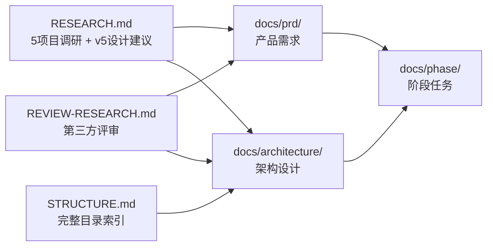

# learn-rust · 文档索引

> 本仓库遵循 SDD（Spec-Driven Development）文档体系。
> 调研与设计已从 `RESEARCH.md` / `STRUCTURE.md` 归档至本文档体系。
> 外部资料汇总：[`docs/reference/sources.md`](./reference/sources.md)
---

## 溯源链路（上游 → 本文档体系）

| 上游（调研/评审） | → | 下游（SDD 文档） | 关键映射 |
|---|---|---|---|
| RESEARCH §1-2（5 项目分析） | → | PRD §1.3（差异化定位） | 竞品定位对比 |
| RESEARCH §3（设计模式矩阵） | → | Architecture §2（技术选型） | 模式分类 → 技术决策 |
| RESEARCH §4（教学哲学） | → | PRD §1.2（痛点） | 错误驱动 → 练习策略 |
| RESEARCH §5（工具链最佳实践） | → | Architecture §2（技术选型） | mdbook/just/xtask 对比 |
| RESEARCH §6.0（核心边界） | → | PRD §0（目标声明） | 8 条设计原则 |
| RESEARCH §6.1（v5 设计方向） | → | PRD §2（功能需求） | 4 大机制 + projects 重排 |
| RESEARCH §6.2（仓库顶层结构） | → | Architecture §3（目录设计） | 目录树展开为分层设计 |
| RESEARCH §6.3（关键技术决策） | → | Architecture §5（ADR 索引） | 决策表 → 8 条 ADR |
| RESEARCH §6.4（6 周落地步骤） | → | Phase §1-6（逐周任务） | 周计划 → 任务分解 + 验收标准 |
| RESEARCH §6.4（v1.0 vs v1.1+） | → | PRD §5（交付范围） | 范围对比表 |
| RESEARCH §6.5（写作模板） | → | PRD §2.1（内容格式约定） | 模板 → 5 段格式 |
| RESEARCH §6.6（长期演进） | → | Phase §8（v1.1+ 预留） | commit 约定 / 可持续发展 |
| RESEARCH §8（竞品参考） | → | Architecture §5（ADR 索引） | 9 项目 → 拒绝理由 |
| REVIEW-RESEARCH.md P0（solutions 隔离） | → | Architecture §3.3（编译隔离设计） | solutions 不含 Cargo.toml |
| REVIEW-RESEARCH.md P1（内容去重） | → | Architecture §6（内容去重策略） | 4 层边界定义 |
| REVIEW-RESEARCH.md P1（内容量 vs 6 周） | → | PRD §5.1（v1.0 范围缩减） | 15-20 篇非 46-51 篇 |
| STRUCTURE.md §2（src/ 详细） | → | Architecture §3.2（内容层设计） | 文件清单 → 设计决策 |
| STRUCTURE.md §3（exercises/） | → | Architecture §3.3（练习层设计） | 23 章列表 → 格式规范 |
| STRUCTURE.md §4（projects/） | → | Architecture §3.4（项目层设计） | 决策框架预埋 |
| STRUCTURE.md §5（notes/） | → | Architecture §3.5（笔记层设计） | gotchas 边界 |
| STRUCTURE.md §6（justfile） | → | Architecture §4.3（构建流） | 4 命令 → 流程图 |
---

## PRD（产品需求文档）

| 日期 | 文档 | 状态 | 备注 |
|---|---|---|---|
| 2026-07-02 | [learn-rust-notebook](./prd/2026-07-02-learn-rust-notebook.md) | 已完成 | Norman 个人 Rust 笔记本 |

## Phase（阶段任务）

| 日期 | 文档 | 状态 | 对应 PRD |
| 2026-07-02 | [v1-foundation](./phase/2026-07-02-v1-foundation.md) | 已完成 | learn-rust-notebook |

## Architecture（架构设计）

| 文档 | 说明 |
|---|---|
| [overview](./architecture/overview.md) | 仓库架构总览：技术选型、目录设计、组件关系、数据流 |

## Reference（参考资料）

| 文档 | 说明 |
|---|---|
|[sources](./reference/sources.md) | 参考文献与资料索引：5 核心项目 + 3 补充参考 + 9 竞品 + 工具 + 外部文章 + 引用速查表 |

---

## 文档约定

- **PRD** — 定义"做什么"：目标用户、功能需求、边界约束、非目标
- **Architecture** — 定义"怎么做"：技术选型、目录结构、组件设计、关键决策
- **Phase** — 定义"何时做"：任务分解、时间线、交付标准、依赖关系
- **Reference** — 外部资料索引、术语表、API 契约

## 相关文件

> **注意**：`RESEARCH.md` 和 `STRUCTURE.md` 的内容已完整归档至本文档体系（PRD + Architecture + Phase + Reference），原始文件不再保留。

- 评审意见：已吸收至 Architecture 和 PRD（P0 solutions 隔离 · P1 内容去重 · P1 内容量修正）
